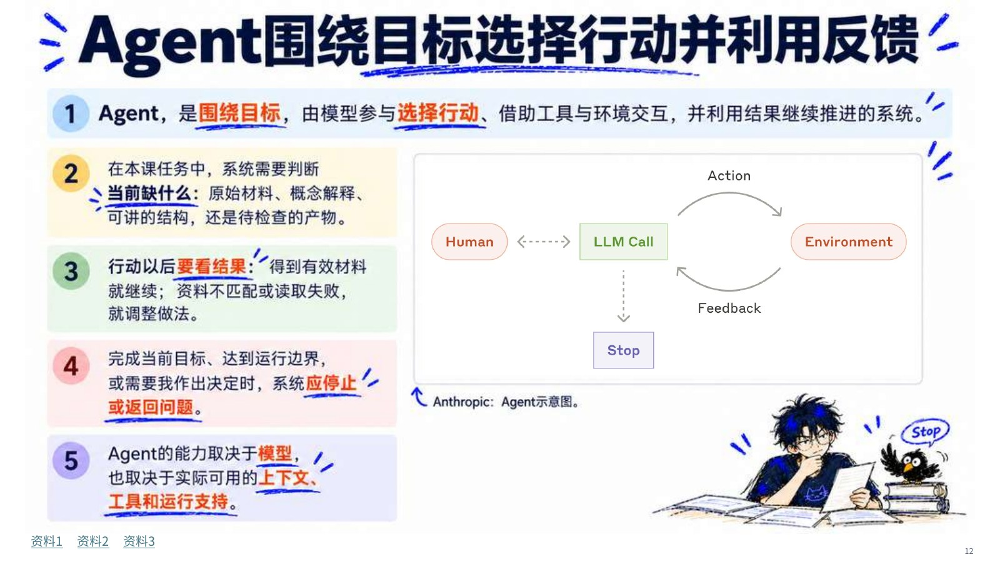
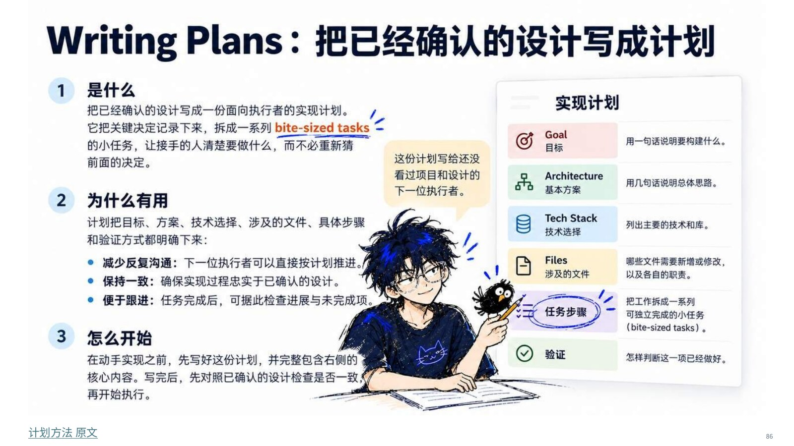

<a id="top"></a>
<p align="center">
  
</p>
<h1 align="center">AI Native Teaching Kit</h1>
<p align="center"><strong>构建 AI 原生科研与教学工作环境</strong><br>面向研究生与教师的中文课程、可编辑教材和视觉教学 Skill</p>
<p align="center">简体中文 · <a href="README.en.md">English</a></p>
<p align="center">
  <a href="https://github.com/qihangzhang-272/ai-native-teaching-kit/releases/latest"></a>
  <a href="LICENSE"></a>
  <a href="LICENSE-SCOPE.md"></a>
</p>
<p align="center">
  <a href="#quick-start"><strong>快速开始</strong></a> ·
  <a href="#downloads"><strong>下载课件</strong></a> ·
  <a href="#skill"><strong>安装与调用 Skill</strong></a>
</p>

把 AI 放进真实工作，常常会遇到一串相连的问题：材料该放在哪里？模型能依据什么？工具怎样执行？任务如何继续？结果怎样检查？这套课程沿着这些问题解释 Prompt、Context、Agent、MCP、Harness 和 Skills，再进入工作台选择与具体方法。

你可以直接拿它学习或授课，也可以修改课件、讲稿与示例。仓库同时开放制作这些材料的方法，帮助你从自己的原始资料开始做下一门课。

<table>
<tr><td align="center"><strong>109 页</strong><br>两版课件，同步讲者备注</td><td align="center"><strong>48 页</strong><br>配套讲课稿</td><td align="center"><strong>71 页</strong><br>学生参考手册</td><td align="center"><strong>66 份 SVG</strong><br>原创教学示意及 PNG</td></tr>
</table>

**导航**　[快速开始](#quick-start) · [成品预览](#gallery) · [课程地图](#curriculum) · [下载与版本](#downloads) · [教学 Skill](#skill) · [目录](#structure) · [FAQ](#faq) · [项目状态](#status) · [贡献](#contributing) · [许可与致谢](#license)

<a id="quick-start"></a>
## 快速开始

**只想先看内容？** 下载[视觉版 PDF][visual-pdf]，从第 1–28 页的关键概念开始。无需 Git、API Key 或 Agent 账号。

| 使用方式 | 准备什么 | 第一次怎么做 | 检查什么 |
| --- | --- | --- | --- |
| **自学** | PDF 阅读器；可选 DOCX 阅读器 | 看[课程导览](course/overview.md)，读一个模块，再拿一个自己的任务作对照 | 能否解释材料、工具、行动与反馈分别在哪里 |
| **授课** | PowerPoint 或兼容 PPTX 的演示软件 | 下载[视觉版 PPTX][visual-pptx]与[讲课稿][lecture]，先试讲一个小节 | 字体与图像是否正常，讲者备注是否可见，内容是否适合学生 |
| **改课** | 可编辑 PPTX / DOCX 的软件 | 下载[文字可编辑版][editable-pptx]与[源素材包][source-zip]，复制后改一个例子 | 同步修改正文、图注、口播、来源及对应导出文件 |
| **制作新课** | 能读取本地文件的 Agent；自己的原始材料 | 先[加载教学 Skill](#skill)，提交一段材料与受众说明 | 先得到内容安排与来源依据，再进入视觉制作 |

阅读和改编课程不要求使用某款 AI 产品。生成新内容所需的模型、图像生成、文件导出能力与费用，由你选择的宿主和工具决定。

<a id="gallery"></a>
## 成品预览

下图来自公开版成品与原创素材包。点击可查看原尺寸；同页的两种课件形态也能直接比较。

<table>
<tr>
<td width="50%"><a href="assets/readme/preview-agent.jpg"></a><br><strong>视觉教学版 · 第 12 页</strong><br>概念解释、任务示意与讲解角色放在一起</td>
<td width="50%"><a href="assets/readme/preview-editable.jpg"></a><br><strong>文字可编辑版 · 第 12 页</strong><br>相同内容，以正文和原生图形便于继续修改</td>
</tr>
<tr>
<td width="50%"><a href="assets/readme/preview-writing-plans.jpg"></a><br><strong>方法讲解 · 第 86 页</strong><br>解释是什么、为什么有用、怎样开始</td>
<td width="50%"><a href="assets/readme/preview-diagram.png"></a><br><strong>原创源素材 · 第 17 页配图</strong><br>SVG 可继续编辑；示意图不冒充真实产品界面</td>
</tr>
</table>

<a id="curriculum"></a>
## 课程地图

五个模块可以按顺序学习，也可以按[逐页索引](course/slides.tsv)选取小节。每个模块附一个建议练习，便于把内容用到自己的任务里。

| 模块 / 页码 | 核心内容 | 学完后可以试着做 |
| --- | --- | --- |
| **01 · 关键概念与真实任务**<br>1–28 | Task、Prompt、Context、模型与工具、Agent / Loop、Function Calling、MCP、Skill、Harness、Workflow、CLI / IDE | 用一个真实任务说明各部分的分工，并列出完成依据 |
| **02 · 我怎么选工作台**<br>29–56 | 开发与办公入口；材料、工作空间、执行地点、权限、过程与产物检查 | 写一张工作环境检查表，说明为什么选择这个入口 |
| **03 · 让个人 Agent 接续工作**<br>57–69 | 持续协作、任务状态、人的反馈、记忆、继续执行与定时工作 | 写一份下一次能接手的任务状态记录 |
| **04 · 把开源 Skill 打开**<br>70–100 | 设计判断、Brainstorming、Writing Plans、TDD、验证、简化实现、Review 与资料读取 | 阅读一个原始 SKILL.md，说明输入、方法、产物和边界 |
| **05 · 我怎样继续学习和更新**<br>101–109 | 从推荐回到作者、官方文档、原作与适用版本 | 为一条准备采用的信息补上原始来源与版本依据 |

**阅读入口：** [课程导览](course/overview.md) · [109 页标题索引](course/slides.tsv) · [来源说明](sources/README.md) · [逐项引用清单](sources/references.tsv)

课程介绍的工作台与开源项目是案例，不是安装本仓库的前置依赖。涉及产品入口、价格、能力和安装方式时，请在实际操作前核对其官方文档。

<a id="downloads"></a>
## 下载与版本

**公开发行版：v1.0.0。** 七个附件应配套使用。PPTX / DOCX 用于修改，PDF 用于阅读；源 ZIP 提供正文、口播、来源和原创示意图。

| 材料 | 直接下载 | 规模 | 使用提示 |
| --- | --- | --- | --- |
| 视觉教学版 | [PPTX][visual-pptx] · [PDF][visual-pdf] | 109 页；13.70 / 16.05 MiB | 适合展示。PPTX 带讲者备注，部分背景为整页图像 |
| 文字可编辑版 | [PPTX][editable-pptx] · [PDF][editable-pdf] | 109 页；0.60 / 3.17 MiB | 大幅修改时优先使用；以原生文字和图形为主 |
| 讲课稿 | [DOCX][lecture] | 48 页；0.09 MiB | 完整口播、解释与转场 |
| 学生参考手册 | [DOCX][handbook] | 71 页；2.89 MiB | 课后阅读与查阅 |
| 内容与原创素材 | [ZIP][source-zip] | 3.37 MiB | Markdown / JSON 正文、口播、来源；66 份 SVG 及 PNG |

[查看本次发布][release] · [查看所有版本](https://github.com/qihangzhang-272/ai-native-teaching-kit/releases) · [分发说明](releases/README.md)

> **注意两种 ZIP：** GitHub 自动生成的 **Source code (zip)** 是仓库快照，不含七个课件附件。需要正文与原创素材，请选择上表中的 **内容与原创素材 ZIP**。DOCX 页数随阅读软件、字体和排版环境可能变化。

仓库与附件分开分发：克隆仓库能得到课程索引、Skill 和说明，但不会自动下载 PPT、PDF 和 DOCX。

<a id="skill"></a>
## 使用视觉教学 Skill

`build-visual-teaching` 是一个包含说明与参考文档的 Skill 目录。它组织内容判断、素材使用、视觉参考和交付检查；生成图片或导出文件仍需要宿主提供相应工具。

### 1. 取得仓库

```bash
git clone https://github.com/qihangzhang-272/ai-native-teaching-kit.git
cd ai-native-teaching-kit
```

没有 Git 也可以从仓库 **Code → Download ZIP** 下载并解压。先阅读 [SKILL.md](skills/build-visual-teaching/SKILL.md)，复制时保留整个目录与 `references/`。

### 2. 选择加载方式

| 环境 | 放置位置 / 方法 | 显式调用 |
| --- | --- | --- |
| **Codex CLI / IDE 的项目内使用** | 复制到当前项目 `.agents/skills/build-visual-teaching/` | `$build-visual-teaching`，或在 `/skills` 中选择 |
| **Claude Code 的项目内使用** | 复制到当前项目 `.claude/skills/build-visual-teaching/` | `/build-visual-teaching` |
| **其他能读取本地文件的 Agent** | 提供 `SKILL.md` 的完整路径，并要求读取所引用的参考文件 | 在任务中明确指定这套方法；不等同于原生 Skill 安装 |

加载方式依据[OpenAI 官方说明](https://learn.chatgpt.com/docs/build-skills)和[Claude Code 官方说明](https://code.claude.com/docs/en/skills)整理；本仓库以独立 Skill 目录分发。

<details>
<summary><strong>展开：macOS / Linux / WSL 的项目内复制命令</strong></summary>

在刚克隆的仓库根目录运行以下一种。若目标已有同名 Skill，先比较并备份，不要覆盖自己的修改。

**Codex CLI / IDE**

```bash
mkdir -p .agents/skills
cp -R skills/build-visual-teaching .agents/skills/
```

**Claude Code**

```bash
mkdir -p .claude/skills
cp -R skills/build-visual-teaching .claude/skills/
```

Windows PowerShell、装到其他项目、加载检查与排错见[详细安装指南](docs/skill-setup.md)。

</details>

### 3. 给它一个完整的小任务

先提供自己的资料文件，再提交下面的任务。使用原生宿主时，将相应的显式调用放在开头。

```text
请使用 build-visual-teaching。

材料：读取我提供的资料，保留原始来源与必要引文。
受众：第一次接触这个主题的研究生。
任务：先做一个教学小节，解释一个关键概念及其实际用途。

先给出：要回答的问题、采用的材料、页面安排及仍缺的信息。
确认后制作：课件、配套讲稿和可继续编辑的正文。
视觉：文字承担解释，配图帮助理解；沿用我提供的参考。
验收：打开最终导出文件，检查文字、图像、来源、链接和备注。
```

**第一次使用要看见什么？** 在视觉制作前，能看到明确的受众、材料与内容安排；制作后，有可打开的实际文件和与其对应的检查结果。工具缺失时应明确说明缺口，不把预览或计划称为成品。

**方法文档：** [讲解结构](skills/build-visual-teaching/references/teaching-depth.md) · [视觉基准](skills/build-visual-teaching/references/visual-benchmarks.md) · [素材融合](skills/build-visual-teaching/references/material-integration.md) · [交付检查](skills/build-visual-teaching/references/delivery-qa.md)

<a id="structure"></a>
## 仓库目录

```text
ai-native-teaching-kit/
├── README.md / README.en.md       # 中英文使用入口
├── course/
│   ├── overview.md               # 课程导览与使用建议
│   └── slides.tsv                # 109 页标题索引
├── skills/build-visual-teaching/
│   ├── SKILL.md                  # 可独立复用的教学制作方法
│   ├── references/               # 结构、素材、视觉与验收细则
│   └── LICENSE                   # Skill 的 MIT 许可
├── docs/                         # 中英文 Skill 安装与排错
├── sources/                      # 来源说明与引用清单
├── assets/readme/                # 封面与公开成品预览
├── releases/README.md            # 附件与版本说明
├── CONTRIBUTING.md               # 问题反馈和修改检查
├── LICENSE                       # 原创 Skill / 代码许可
└── LICENSE-SCOPE.md              # 教学文字与素材的许可范围
```

源素材 ZIP 内另有 `学生正文`、`完整口播`、`公开来源索引` 的 Markdown / JSON，以及 `原创示意/`。修改源文字不会自动更新已烘焙进图片的文字；请同步检查课件和导出文件。

<a id="faq"></a>
## 常见问题

<details>
<summary><strong>没有编程基础，也能用吗？需要付费 AI 吗？</strong></summary>

阅读 PDF、学习课程和修改 Office 文件不需要编程或 AI 订阅。运行教学 Skill 需要能读取文件的 Agent；如果要生图、导出或调用外部服务，是否可用及是否收费取决于对应宿主。

</details>

<details>
<summary><strong>两版 PPT 内容一样吗？为什么有些文字选不中？</strong></summary>

两版对应同一套 109 页课程，并带同步讲者备注。视觉版保留插画式页面，部分背景是整页图像；文字可编辑版以原生文字和图形为主。需要改正文时优先选后者，阅读时可选任一 PDF。

</details>

<details>
<summary><strong>为什么 clone 或 Download ZIP 后找不到课件？</strong></summary>

大文件在 [Release 附件][release]中，未放进 Git 历史。请下载明确命名的 PPTX、PDF、DOCX 和内容素材 ZIP；GitHub 自动生成的 Source code 压缩包只有仓库文件。

</details>

<details>
<summary><strong>Skill 没有出现，或没有按预期工作怎么办？</strong></summary>

先检查路径是否正好是宿主要求的目录，且目录内有 `SKILL.md` 与 `references/`；确认会话在相应项目里。用显式调用测试，并让 Agent 说明实际读取的 Skill 路径。仍无效时查看[加载与排错指南](docs/skill-setup.md#troubleshooting)，不要反复覆盖安装或删除已有 Skill。

</details>

<details>
<summary><strong>可以拿来授课、改编或商用吗？</strong></summary>

MIT 与 CC BY 4.0 分别允许其覆盖内容的使用和改编，包括商业使用，但需遵守相应许可条件。课程是混合内容：第三方引用、商标、字体和个人角色母版不能一概套用这两个许可。复用前请读[许可范围](LICENSE-SCOPE.md)与附件说明。

</details>

<details>
<summary><strong>图片是产品的真实截图吗？</strong></summary>

公开版已将原版中的第三方截图、书页、作品图和具名作者肖像替换为原创教学示意，并保留阅读来源。标注“教学示意”的画面用于解释关系，不能据此判断实际界面、运行结果或性能。

</details>

<details>
<summary><strong>有英文课程或一键生成整套课的脚本吗？</strong></summary>

当前 README 和安装指南提供中英两版；课程正文、讲稿、手册与 Skill 以中文为主。本仓库没有一键重建全部课件的脚本，也不附带个人角色母版。Skill 提供方法，具体产出依赖材料、工具与检查。

</details>

<a id="status"></a>
## 项目状态

| 范围 | 当前状态 |
| --- | --- |
| 课程 | v1.0.0 公开版，五个模块、109 页，两种课件形态 |
| 配套材料 | 讲课稿、学生手册、正文与原创素材包 |
| 制作方法 | 独立 Skill + 参考文档；无插件市场包 |
| 语言 | README 与安装指南中英双版；课程材料主要为中文 |
| 产品时效 | 保留课程版本背景，实际使用前按来源核对 |

适合继续贡献的方向包括：带来源的概念纠错、产品入口更新、不同学科的教学例子、真实宿主安装反馈与翻译。可以先在 [Issues](https://github.com/qihangzhang-272/ai-native-teaching-kit/issues) 讨论范围。

<a id="contributing"></a>
## 参与贡献

1. **报告问题：** 写明版本、文件名、页码或路径、实际问题与建议依据
2. **改进内容：** 一次聚焦一个问题，保留来源和限定条件；修改中英文说明时保持含义一致
3. **提交前检查：** 核对链接、版面、图文和备注；不上传私人对话、账号信息或未授权素材

完整流程与可复制的反馈模板见 [CONTRIBUTING.md](CONTRIBUTING.md)。

<a id="license"></a>
## 许可与致谢

**作者：张启航 / BLAZE**

| 内容 | 许可 / 使用依据 |
| --- | --- |
| 本项目原创 Skill 与代码 | [MIT](LICENSE) |
| 已确认权属的原创教学文字 | [CC BY 4.0](https://creativecommons.org/licenses/by/4.0/)：署名、链接来源及许可、说明修改 |
| 个人角色、混合课件与原创图示 | 依据[许可范围](LICENSE-SCOPE.md)及附件中的使用说明 |
| 第三方方法、引用、商标、字体与外部作品 | 保留各自权利与许可，来源链接不自动赋予再分发权 |

建议署名：**张启航 / BLAZE，AI Native Teaching Kit**，附本仓库链接；有修改时说明改动。

感谢课程引用的作者与项目，包括 [Anthropic Skills](https://github.com/anthropics/skills)、[Superpowers](https://github.com/obra/superpowers)，以及[来源清单](sources/README.md)中的原始材料。课程中的教学归纳与个人使用经验不代表相关作者或厂商的官方立场。

<p align="right"><a href="#top">回到顶部 ↑</a></p>

[release]: https://github.com/qihangzhang-272/ai-native-teaching-kit/releases/tag/v1.0.0
[visual-pptx]: https://github.com/qihangzhang-272/ai-native-teaching-kit/releases/download/v1.0.0/ai-native-teaching-kit-v1.0.0-visual-slides.pptx
[visual-pdf]: https://github.com/qihangzhang-272/ai-native-teaching-kit/releases/download/v1.0.0/ai-native-teaching-kit-v1.0.0-visual-slides.pdf
[editable-pptx]: https://github.com/qihangzhang-272/ai-native-teaching-kit/releases/download/v1.0.0/ai-native-teaching-kit-v1.0.0-editable-slides.pptx
[editable-pdf]: https://github.com/qihangzhang-272/ai-native-teaching-kit/releases/download/v1.0.0/ai-native-teaching-kit-v1.0.0-editable-slides.pdf
[lecture]: https://github.com/qihangzhang-272/ai-native-teaching-kit/releases/download/v1.0.0/ai-native-teaching-kit-v1.0.0-lecture-notes.docx
[handbook]: https://github.com/qihangzhang-272/ai-native-teaching-kit/releases/download/v1.0.0/ai-native-teaching-kit-v1.0.0-student-handbook.docx
[source-zip]: https://github.com/qihangzhang-272/ai-native-teaching-kit/releases/download/v1.0.0/ai-native-teaching-kit-v1.0.0-original-content-and-assets.zip
